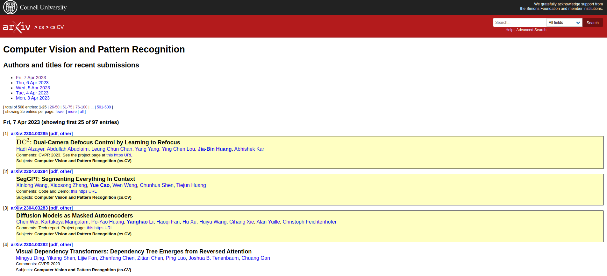
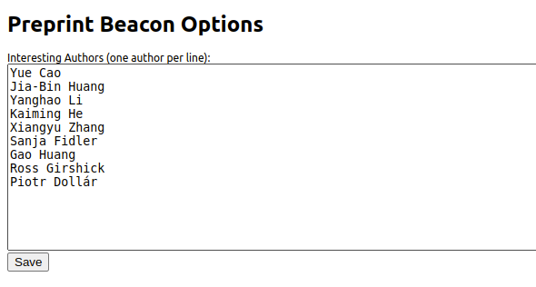

# Preprint Beacon

**Never Miss Your Favored Authors!**

Preprint Beacon is a Chrome extension that enhances your browsing experience on preprint repositories like arXiv by highlighting papers from interesting authors.

**Acknowledgment:** Thank you to arXiv for use of its open access interoperability.

**Note:** The motivation of this project is to experience the paired programming ability of GPT-4. The vast majority of the code in this project, including the CHANGELOG and README, is implemented by GPT-4.

## Preview
Randomly pick several authors for preview.

## Features

- Highlight papers from a customizable list of interesting authors.
- Bold author names for highlighted papers.

## Installation

1. Clone this repository or download it as a ZIP file.
2. In Chrome, go to `chrome://extensions`.
3. Enable "Developer mode" in the top right corner.
4. Click "Load unpacked" and select the folder containing the downloaded repository.

## Usage

1. Open the extension's options page by right-clicking the Preprint Beacon icon in the Chrome toolbar and selecting "Options".
2. Add or remove authors from the list of interesting authors.
3. Visit an arXiv listing page, and the extension will automatically highlight papers from the interesting authors.

## Changelog

See [CHANGELOG.md](CHANGELOG.md) for a detailed list of changes.
